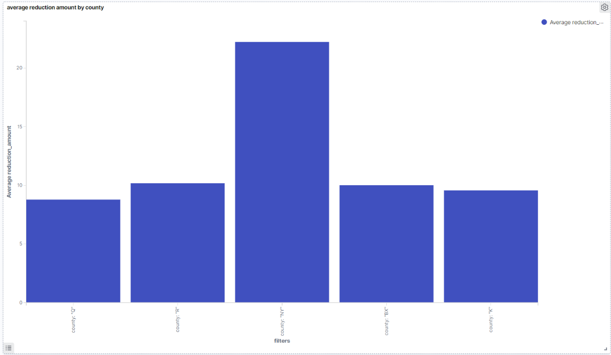
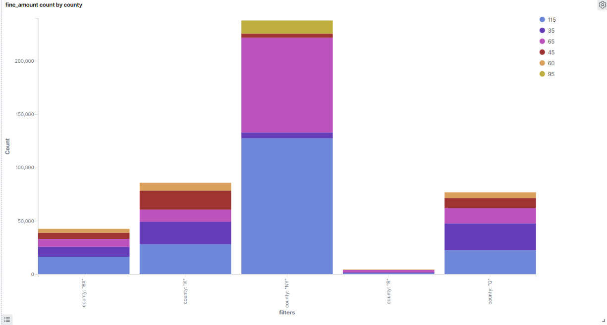
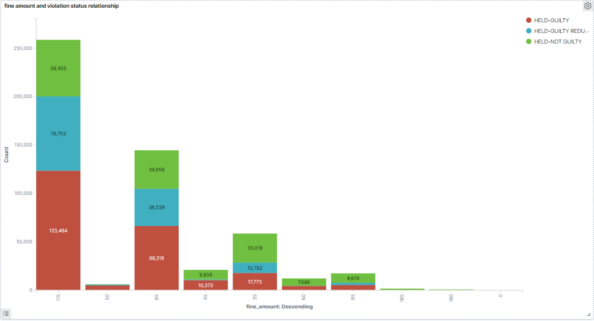
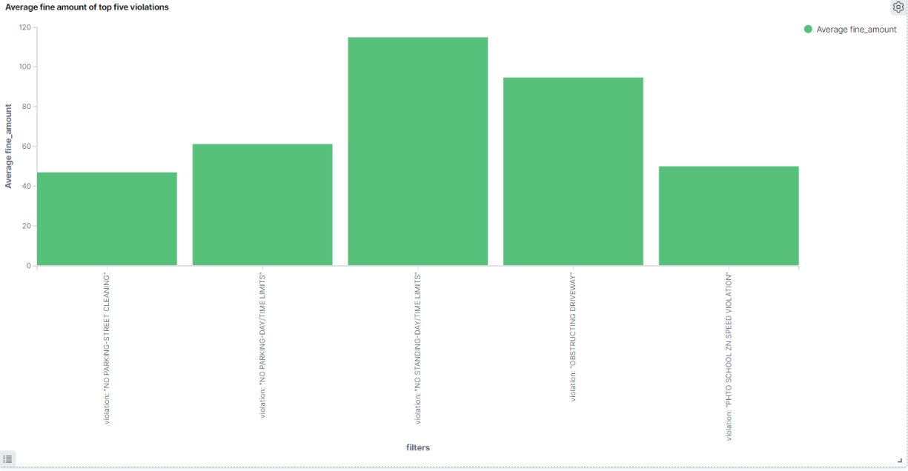

# Project01:Analyzing Millions of NYC Parking Violations

Using AWS EC2 service to build a docker image Bigdata01, run a container of the image and use python scripts to load data into AWS Elasticsearch. Visualized and analyzed data on Kibana.

## Build docker image

Run the command below in AWS EC2 terminal.

```bash
docker build -t bigdata1:1.0 project01/
```

## Run a container of the image

Run the command below in AWS EC2 terminal after successfully built the image. 
--page_size: Required. It will ask for how many records to request from the API per call.
--num_pages: Optional. If not provided, it will continue requesting data until the entirety of the content has been exhausted. If this argument is provided, continue querying for data num_pages times.

```bash
docker run -v ${pwd}:/src \
	-e DATASET_ID="nc67-uf89" \
	-e APP_TOKEN="YOUR APP TOKEN" \
	-e ES_HOST="" \
	-e ES_USERNAME="" \
	-e ES_PASSWORD="" \
	bigdata1:1.0 --num_pages=3 --page_size=2
```

#Visualizing and Analysis on Kibana

I have created 4 visualizations in 1 dashboard on Kibana. 



Chart 1 "Average reduction amount by county" indicate that NY county has the highest average reduction amount while Queens has the lowest reduction amount.



Chart 2 "Fine amount count by county" shows that NY county has issued the most tickets over five counties, and most of the fine amount are 115 and 65, which is much more expensive than in other counties.



Chart 3 "Fine amount and violation status relationship" shows that tickets with fine amount of 115 and 65 shows a similar pattern regarding  therir violation status, most of the tickets will still have to pay for their ticket, and tickets with fine amount of 35 will more likely to be determined as not guilty or deduct the fine amount.



Chart 4 "Average fine amount of top five violations" shows that "No standing-day/time limits" has the highest average fine amount.
